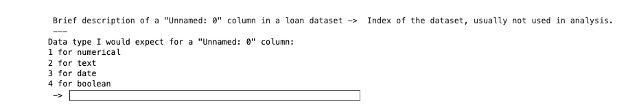
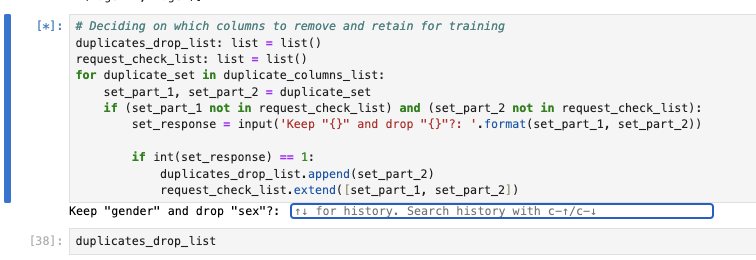
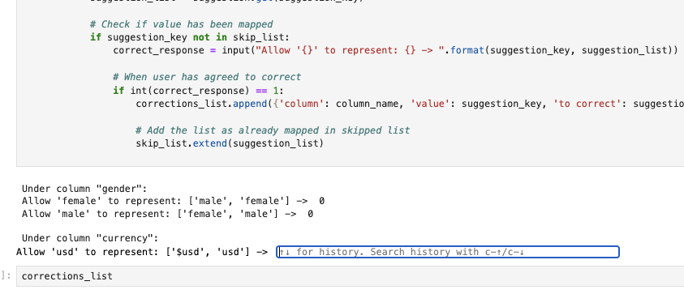
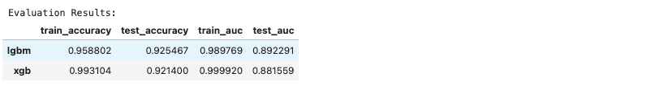
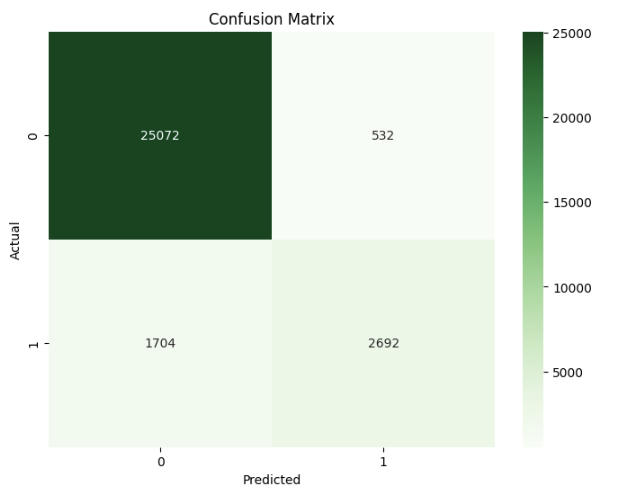
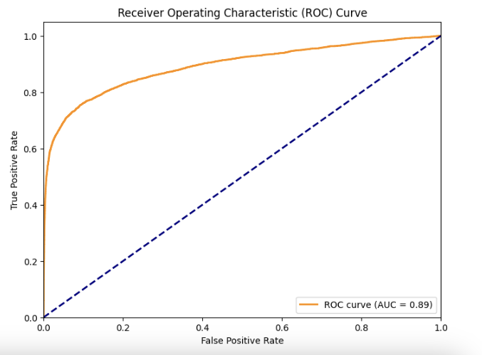
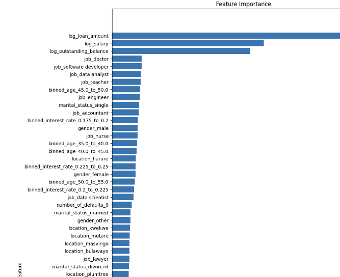

# Loan Default Prediction Model

## Data Science Competition 2024 Submission

This project is a submission for the Data Science Competition 2024, focusing on predicting the probability of default (
PD) on loans using historical loan data.

## Project Overview

This project aims to develop a predictive model that estimates the probability of default on loans using historical loan
data. The model is crucial for risk management and strategic planning in financial institutions.

## Dataset Description

The dataset contains historical information about borrowers, including various features that may impact the probability
of default.
Here's an explanation of the variables in point form, using the column name and description:

- `Unnamed: 0`: Index of the dataset, usually not used in analysis.
- `loan_id`: Unique identifier for each loan.
- `gender`: Gender of the applicant (e.g., male, female).
- `disbursement_date`: Date when the loan was granted.
- `currency`: Currency in which the loan amount is stated.
- `country`: Country where the loan is issued.
- `sex`: May be a duplicate of gender; indicates applicant's sex.
- `is_employed`: Employment status of the applicant (e.g., employed, unemployed).
- `job`: Type of employment or job title of the applicant.
- `location`: Geographical location of the applicant.
- `loan_amount`: Total amount of the loan requested.
- `number_of_defaults`: Number of times the applicant has defaulted on previous loans.
- `outstanding_balance`: Remaining balance on the loan at the time of assessment.
- `interest_rate`: Interest rate applicable to the loan.
- `age`: Age of the applicant at the time of loan application.
- `number_of_defaults.1`: May be a duplicate of number of defaults; indicates defaults on loans.
- `remaining term`: Remaining term of the loan in months.
- `salary`: Monthly or annual salary of the applicant.
- `marital_status`: Marital status of the applicant (e.g., single, married).
- `age.1`: Could be a duplicate of age; indicates applicant's age.
- `Loan Status`: Current status of the loan (e.g., approved, rejected, defaulted).

## Project Structure

```

.
├── api/ # Directory for the FastAPI deployment project
   ├── logs/ # API app logs and data drift logs
   ├── prediction/ # Prediction results
   ├── .env/ # Environment file
   ├── _init.py # API app initialization file
   ├── main.py # FastAPI application
   ├── requirements.txt # Project dependencies
├── model/ # Directory for machine learning model development
   ├── cv_results/ # Cross-validation results
   ├── data/ # Directory for dataset storage
   ├── deployed_models/ # Saved models for deployment
   ├── eda/ # EDA reports and visualizations
   ├── model_fitting/ # Model fitting results
   ├── transformations/ # Data transformation scripts
      ├── train_model.ipynb # Jupyter notebook for model development
└── README.md # Project documentation

```

## Installation

1. Clone the repository:
   ```
    git clone https://github.com/TheRealSirBen/Claxon-Data-Science-Hackathon-Loan-Default-Prediction.git
   ```

## Model building approach

1. **Data Cleaning**: (Describe the data cleaning techniques used and justify decisions)

2. **Exploratory Data Analysis (EDA)**: (Summarize key findings from EDA, including visualizations and interesting
   observations)

3. **Feature Engineering**: (Explain the feature selection methods and justify choices)

4. **Data preprocessing**

5. **Hyperparameter Tuning and Model building**: (Discuss scaling and transformation techniques applied)

6. **Model evaluation**: (Discuss the model evaluation and model selection techniques)

### Model training and building

1. Open anaconda prompt

2. Open jupyter notebook. Run:
   ```
    jupyter notebook
   ```
3. Navigate to `Claxon-Data-Science-Hackathon-Loan-Default-Prediction` cloned dir
4. Navigate to `model` dir
5. Open `train_model.ipynb` file
6. Select the `Restart kernel and run all cell` button, then click to execute all commands
7. Wait for the program to request your input, thrice!

    1. For data expectations request
       

    2. For duplicate drop columns list
       

    3. For cell value corrections
       

8. Wait until the whole program concludes

### Model Performance

1. Evaluation set result
   

2. Confusion result
   

3. ROC Curve
   

## API endpoints

1. In terminal or cmd, navigate to api
   ```
    cd api
   ```

2. Create a virtual environment:
    1. On windows
   ```
   python -m venv venv
   source venv/bin/activate # On Windows use `venv\Scripts\activate`
   ```

3. Install the required packages:
   ```
   pip install -r requirements.txt
   ```

## Usage

1. To start the FastAPI server:
   ```
   uvicorn main:app --port 8000 
   ```

2. Access the API home page at `http://localhost:8000`
3. Access the API endpoints at page at `http://localhost:8000/docs`

## API Endpoints

The FastAPI application in `main.py` serves the trained model. Key endpoints include:

- `/api/predict/entry`
- `/api/predict/file`
- `/api/download/csv-template`
- `/api/data-drift`

### Single Prediction

This endpoint allows you to make a prediction for a single loan entry.

- **URL**: `/api/predict/entry`
- **Method**: POST
- **Tags**: Predictions

##### Request Body

The request body should be a JSON object containing the loan entry data. The input should match the `ModelInput` schema,
which includes all the necessary features for making a prediction.

##### Response

- **Success Response**:
    - **Code**: 200 OK
    - **Content**:
      ```json
      {
        "message": "Prediction successful",
        "data": {
          "prediction": 0.123
        }
      }
      ```

- **Error Response**:
    - **Code**: 400 BAD REQUEST
    - **Content**:
      ```json
      {
        "message": "The [column_name] entry value(s) can not be converted to date"
      }
      ```
  This error occurs when the date columns in the input data cannot be properly parsed.

#### Functionality

1. The endpoint receives loan data as input.
2. It converts the input data into a DataFrame.
3. It performs a date fitness check to ensure all date columns are properly formatted.
4. If the date check fails, it returns a 400 error with details about which column(s) caused the issue.
5. If the date check passes, it transforms the data using a `transform_data` function.
6. It then uses a pre-trained model to predict the probability of loan default.
7. Finally, it returns the prediction probability along with a success message.

### File Upload Prediction

This endpoint allows you to upload a CSV file containing multiple loan entries and receive predictions for all entries
in the file.

- **URL**: `/api/predict/file`
- **Method**: POST
- **Tags**: Predictions

#### Request

- **Content-Type**: multipart/form-data
- **Body**:
    - `file`: A CSV file containing loan data (required)

#### Response

- **Success Response**:
    - **Code**: 200 OK
    - **Content**: A CSV file containing the original data along with predictions

- **Error Responses**:
    - **Code**: 400 BAD REQUEST
        - If the file size exceeds the limit (50MB)
        - If the file columns don't match the expected columns
        - If date columns cannot be properly parsed
        - If the file type is not CSV

#### Functionality

1. The endpoint receives a CSV file upload.
2. It checks if the file is a CSV and if its size is within the limit (50MB).
3. It reads the CSV file into a DataFrame.
4. It validates that the columns in the file match the expected columns. If not, it returns a template CSV file.
5. It performs a date fitness check to ensure all date columns are properly formatted.
6. If the date check fails, it returns a 400 error with details about which column(s) caused the issue.
7. If all checks pass, it transforms the data using a `transform_data` function.
8. It then uses a pre-trained model to predict the probability of loan default for all entries.
9. Finally, it saves the original data along with the predictions to a new CSV file and returns this file as the
   response.

### Download CSV Template

This endpoint allows users to download a CSV template that matches the expected format for loan data input.

- **URL**: `/api/download/csv-template`
- **Method**: GET
- **Tags**: Data management

#### Request

This endpoint doesn't require any parameters or request body.

#### Response

- **Success Response**:
    - **Code**: 200 OK
    - **Content**: A CSV file named "template.csv"

#### Functionality

1. The endpoint generates a DataFrame with the expected columns for loan data.
2. It creates a CSV file named "template.csv" with these columns and 5 empty rows.
3. It returns this CSV file as a downloadable response.

### Data Drift Features

This endpoint retrieves a list of unique features that have experienced data drift, as recorded in the datadrift.log
file.

- **URL**: `/api/data-drift`
- **Method**: GET
- **Tags**: Data Management

#### Request

This endpoint doesn't require any parameters or request body.

#### Response

- **Success Response**:
    - **Code**: 200 OK
    - **Content**:
      ```json
      {
        "message": "Successfully retrieved drift update",
        "data": [
          "feature1",
          "feature2"
        ]
      }
      ```
      The `data` field contains an array of strings, each representing a unique feature that has experienced drift.

#### Functionality

1. The endpoint reads the `datadrift.log` file.
2. It extracts and compiles a list of unique features that have been logged as experiencing drift.
3. It returns this list along with a success message.

## Model Analysis

- Feature Importance: (Interpret model coefficients or feature importance's)
  

## Data Drift Detection

Our system implements a robust mechanism for detecting data drift, which is crucial for maintaining model performance
over time. We use a combination of statistical methods and logging to identify when input features deviate significantly
from the training data distribution.

### Implementation

1. **Logging**: We use a custom logger to record new feature values:

```python
import logging

logger = logging.getLogger('datadrift')
logger.setLevel(logging.INFO)
handler = logging.FileHandler('datadrift.log')
logger.addHandler(handler)


def log_new_feature(feature_name, feature_value):
    logger.info(f"new - {feature_name}_{feature_value}")
```

2. **Statistical Testing**: We periodically compare the distribution of recent data to the baseline distribution using
   the Kolmogorov-Smirnov test:

```python
from scipy import stats


def detect_drift(baseline_data, new_data, threshold=0.05):
    ks_statistic, p_value = stats.ks_2samp(baseline_data, new_data)
    if p_value < threshold:
        return True
    return False
```

3. **Monitoring**: We've implemented the `/api/data-drift` endpoint to retrieve features that have experienced drift.

### Importance

Detecting data drift is crucial for:

- Identifying when the model needs retraining
- Understanding changes in the underlying data distribution
- Maintaining model accuracy and reliability over time

## Model Limitations

While our loan default prediction model performs well in many scenarios, it's important to acknowledge its limitations:

1. **Limited Historical Data**: The model may not perform well for unprecedented economic conditions not represented in
   the training data.

2. **Feature Constraints**: The model relies on a fixed set of features and may not capture all relevant factors
   influencing loan default.

3. **Demographic Bias**: There's a potential for bias if the training data is not representative of all demographic
   groups.

4. **Economic Volatility**: The model may struggle to adapt quickly to rapid economic changes.

5. **Regulatory Changes**: The model doesn't account for future changes in lending regulations.

## Future Improvements

To enhance our model's performance and reliability, we propose the following improvements:

1. **Implement Automated Retraining**:

```python
def should_retrain(drift_count, threshold=10):
    return drift_count > threshold


if should_retrain(len(get_data_drift_features())):
    retrain_model()
```

2. **Expand Feature Set**: Incorporate additional relevant features such as macroeconomic indicators.

3. **Explainable AI**: Implement SHAP (SHapley Additive exPlanations) values for better model interpretability.

4. **Continuous Learning**: Develop a system for continuous model updating with appropriate safeguards.

## Business Implications

Our loan default prediction model and data drift detection system have several important business implications:

1. **Risk Management**: Improved ability to assess loan default risk, potentially reducing financial losses.

2. **Operational Efficiency**: Automation of loan approval process can speed up decision-making and reduce manual work.

3. **Customer Experience**: Faster loan approvals can improve customer satisfaction and potentially increase market
   share.

4. **Regulatory Compliance**: Better documentation and monitoring of the decision-making process can aid in regulatory
   compliance.

5. **Strategic Planning**: Insights from the model and drift detection can inform long-term business strategy and
   product development.

6. **Cost Savings**: Early detection of changing patterns can prevent losses due to outdated models.

To quantify these benefits, we recommend:

```python
def calculate_roi(prev_default_rate, new_default_rate, total_loan_amount):
    savings = (prev_default_rate - new_default_rate) * total_loan_amount
    implementation_cost = 100000  # Estimated cost
    roi = (savings - implementation_cost) / implementation_cost * 100
    return f"{roi:.2f}%"


roi = calculate_roi(0.05, 0.03, 10000000)
print(f"Estimated ROI: {roi}")
```

By continually monitoring and improving our model, we can maintain a competitive edge in the lending market while
managing risk effectively.

```


---

This project was developed as part of the Data Science Competition 2024. For any questions or clarifications, please
contact competitions@claxonactuaries.com.